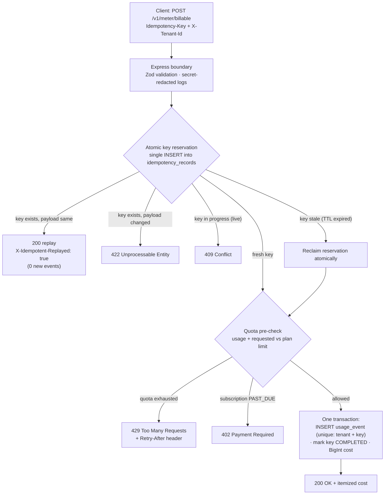
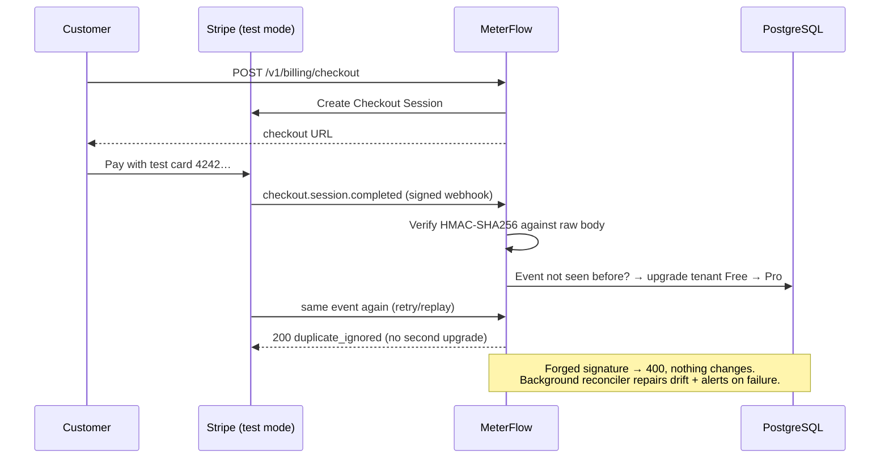
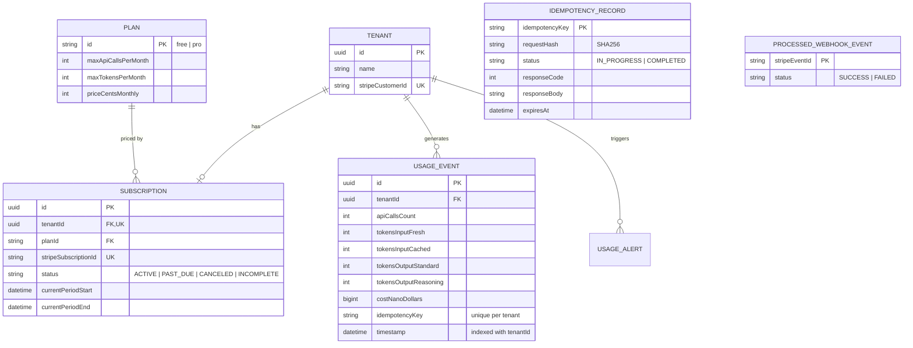

# ⚡ MeterFlow — Usage Metering & Billing Engine

[](https://github.com/abubakar-ahmed-dev/meterflow-billing-engine/actions)


A multi-tenant **usage metering and billing engine** built for the FlyRank Backend Track capstone. It answers the three questions every SaaS must get right — **how much has this customer used, what does it cost, and have they hit their limit?** — correctly, even under network retries, webhook replays, and concurrent requests.

**The three hard problems this project solves:**

| Problem | How MeterFlow solves it | Proof |
| :--- | :--- | :--- |
| A retried request double-charges the customer | Atomic idempotency-key reservation + a database-level unique constraint | [EVIDENCE §1](EVIDENCE.md#1-metering--exactly-once-under-retries-section-6-metering-box) |
| Quota checked *after* the expensive AI call already ran | Pre-action quota gate with honest `429` / `402` semantics | [EVIDENCE §2](EVIDENCE.md#2-quotas--boundary-honesty-429--402-section-6-quotas-box) |
| Floating-point math silently loses money | All costs in `BigInt` integer nano-dollars; no float anywhere in the money path | [EVIDENCE §3](EVIDENCE.md#3-cost-calculation--pinned-pricing-rules-section-6-cost-box) |

---

## 🚀 Quickstart

One command boots everything (PostgreSQL via Docker, migrations, demo data, server):

```bash
git clone https://github.com/abubakar-ahmed-dev/meterflow-billing-engine.git
cd meterflow-billing-engine
cp .env.example .env
npm install
npm run up
```

The engine is now live at **http://localhost:3000**:

| URL | What it is |
| :--- | :--- |
| [`/`](http://localhost:3000/) | Guided product homepage — what the system is and how to prove it works |
| [`/dashboard`](http://localhost:3000/dashboard) | Interactive testing console — run all acceptance probes with one click |
| [`/guides`](http://localhost:3000/guides) | Six engineering deep-dives into each subsystem |
| [`/docs`](http://localhost:3000/docs) | OpenAPI 3.0 reference (executable in Swagger UI) |
| [`/health`](http://localhost:3000/health) | Liveness + database readiness probe |

<details>
<summary><strong>Manual setup (step by step)</strong></summary>

```bash
cp .env.example .env       # placeholders only — no real secrets needed
docker compose up -d       # PostgreSQL 16
npm install
npx prisma migrate deploy  # apply committed migrations
npm run seed               # 4 demo tenants + 2 plans
npm run build && npm start # or: npm run dev (auto-reload)
```

</details>

---

## 🧪 The Five Acceptance Probes

The brief promises five behavioral probes an evaluator can run. All five are verified live and by automated tests — transcripts in [`EVIDENCE.md`](EVIDENCE.md), runnable with one click from the [`/dashboard`](http://localhost:3000/dashboard) console:

| # | Probe | Result |
| :--- | :--- | :--- |
| 1 | Same request twice with one `Idempotency-Key` → **one** usage event; second response mirrors the first | ✅ |
| 2 | At the quota boundary, the request at 1,000 succeeds; the next is refused with `429` (+ `Retry-After`); lapsed subscription gets `402` | ✅ |
| 3 | Signed checkout webhook flips a tenant **Free → Pro**; `GET /v1/usage` shows the new limits | ✅ |
| 4 | Forged webhook → `400`, nothing changes; replayed event → processed once, then `duplicate_ignored` | ✅ |
| 5 | Cached-input and reasoning-token rules produce exact pinned totals; `GET /v1/usage` matches | ✅ |

Run the whole suite yourself:

```bash
npm test        # 35 tests across 6 files, ~7s, needs the database from `npm run up`
```

---

## 🏗️ Architecture

### Request lifecycle — every billable call walks this path



The database is the final authority: `usage_events` carries a unique constraint on `(tenantId, idempotencyKey)`, so even a writer that lost every application-level race cannot create a second event. A 12-request parallel flood yields exactly one row — see the [concurrency test](tests/integration/concurrency.test.ts).

### Payment sync — Stripe stays the source of truth



Works in two modes with the same handler code — see [Stripe dual mode](#-stripe-integration-dual-mode).

### Data model



Schema lives in [`prisma/schema.prisma`](prisma/schema.prisma), applied through committed migrations in [`prisma/migrations/`](prisma/migrations) — no `db push` shortcuts.

---

## 💰 Token Pricing (pinned in [`src/config/pricing.ts`](src/config/pricing.ts))

| Token category | Price | Rule |
| :--- | :--- | :--- |
| Fresh input | \$2.00 / 1M tokens | base rate |
| Cached input | \$0.50 / 1M tokens | **75% discount** — billed separately |
| Standard output | \$8.00 / 1M tokens | base output rate |
| Reasoning ("thinking") | \$8.00 / 1M tokens | **billed exactly as output** — never free |
| API calls | \$10.00 / 1M calls | flat per-call rate |

All arithmetic is `BigInt` in nano-dollars ($1 = 10⁹ nano). Worked example with the [canonical test vector](EVIDENCE.md#3-cost-calculation--pinned-pricing-rules-section-6-cost-box): 1,200 fresh + 400 cached + 600 output + 250 reasoning = **9,400,000 nano = \$0.009400** — exact, every time.

**Plans** (seeded by [`prisma/seed.ts`](prisma/seed.ts)):

| Plan | Price | API calls / month | AI tokens / month |
| :--- | :--- | :--- | :--- |
| Free | \$0 | 1,000 | 100,000 |
| Pro | \$29 | 50,000 | 5,000,000 |

---

## 📡 API Surface

Full reference at [`/docs`](http://localhost:3000/docs) · machine contract in [`capstone.yaml`](capstone.yaml).

| Method | Endpoint | Purpose |
| :--- | :--- | :--- |
| `POST` | `/v1/meter/billable` | Record a billable action (idempotent). Requires `Idempotency-Key` + `X-Tenant-Id` |
| `POST` | `/v1/generate` | Dummy AI-generation endpoint exercising the full pipeline |
| `GET` | `/v1/usage` | Rollup for the billing period: used / limit / remaining / itemized cost |
| `POST` | `/v1/billing/checkout` | Create a Stripe Checkout session (Pro upgrade) |
| `POST` | `/v1/webhooks/stripe` | Signature-verified webhook receiver (`checkout.session.completed`, `customer.subscription.updated`, `customer.subscription.deleted`) |
| `GET` | `/health` | Liveness + database readiness |

Quick taste:

```bash
curl -i -X POST http://localhost:3000/v1/meter/billable \
  -H "Content-Type: application/json" \
  -H "X-Tenant-Id: 00000000-0000-0000-0000-000000000001" \
  -H "Idempotency-Key: my-first-request" \
  -d '{"tokens": {"freshInput": 1200, "cachedInput": 400, "standardOutput": 600, "reasoning": 250}}'
# → 200 OK with itemized cost. Send it again → same body + X-Idempotent-Replayed: true
```

**Demo tenants** (pre-seeded, ready for probe runs):

| Tenant | UUID | Scenario |
| :--- | :--- | :--- |
| Acme Corp | `…0001` | Free plan, clean slate |
| Globex Inc | `…0002` | Pro plan |
| Boundary Org | `…0003` | **999 / 1,000 calls used** — one call from the 429 wall |
| Lapsed LLC | `…0004` | `PAST_DUE` subscription — instant `402` |

---

## 🔌 Stripe Integration (dual mode)

Stripe has **no merchant program in Pakistan**, so this project ships with two modes behind identical handler code:

| Mode | Config | What happens |
| :--- | :--- | :--- |
| **A — Signed simulation** (default) | `MOCK_STRIPE=true` | `npm run stripe:trigger -- checkout.session.completed` fires schema-faithful payloads signed with Stripe's own SDK (`generateTestHeaderString`) — the server-side verification path is byte-identical to a real webhook |
| **B — Real Stripe test mode** | `MOCK_STRIPE=false` + real `sk_test_` / `whsec_` keys | Real Checkout Sessions with test card `4242 4242 4242 4242`; forward events via `stripe listen --forward-to localhost:3000/v1/webhooks/stripe` |

Missing keys **fail closed** (HTTP 500 `ConfigurationError`) — there are no placeholder-secret fallbacks that a forged webhook could exploit. Rationale in [`BUILDLOG.md`](BUILDLOG.md), Phase 4b.

---

## 📁 Project Structure

```text
├── capstone.yaml              # evaluator manifest (run / seed / test / endpoints)
├── EVIDENCE.md                # one pasted proof per requirement — start here
├── BUILDLOG.md                # honest AI-usage and decision log
├── DESIGN.md                  # architecture + ADRs
├── plans/completion-plan.md   # phased build plan (7 phases, all shipped)
├── docs/guides/               # 6 engineering deep-dives (also served at /guides)
├── prisma/
│   ├── migrations/            # committed migrations (init, job_run_logs)
│   ├── schema.prisma
│   └── seed.ts                # deterministic demo data
├── scripts/
│   ├── up.mjs                 # `npm run up` one-command bootstrap
│   └── simulate-webhook.ts    # `stripe trigger` equivalent
├── src/
│   ├── controllers/           # HTTP layer (Express)
│   ├── services/              # MeterService · QuotaService · CostCalculator · StripePaymentService · AlertService
│   ├── jobs/                  # reconciliation worker (cron + retries + alerts)
│   ├── views/                 # shared design tokens + page shell
│   ├── config/                # pinned pricing constants
│   └── db/                    # Prisma client
└── tests/
    ├── unit/                  # pricing exactness, fail-closed config
    └── integration/           # 5 acceptance probes, concurrency flood, lifecycle
```

---

## 📚 Documentation Map

| Read | For |
| :--- | :--- |
| [`EVIDENCE.md`](EVIDENCE.md) | **Verifiable proof**: transcripts + test output for every requirement, probe, and shared requirement |
| [`DESIGN.md`](DESIGN.md) | Data model, API contract, idempotency protocol, pricing formulas, 7 ADRs |
| [`BUILDLOG.md`](BUILDLOG.md) | Where AI helped, where it was wrong, what changed — honest lifecycle log |
| [`capstone.yaml`](capstone.yaml) | Evaluator manifest: run / seed / test commands, endpoints, tenant IDs |
| [`docs/guides/`](docs/guides/README.md) | Deep dives: [idempotency](docs/guides/02-exactly-once-metering-and-idempotency.md) · [quota boundaries](docs/guides/03-quota-enforcement-and-http-boundaries.md) · [integer pricing](docs/guides/04-ai-token-pricing-and-integer-math.md) · [webhook security](docs/guides/05-stripe-webhooks-and-cryptographic-security.md) · [production architecture](docs/guides/06-production-architecture-and-background-jobs.md) |
| [`plans/completion-plan.md`](plans/completion-plan.md) | How the project was completed: 7 phases, gates, evidence per phase |

---

## ⚖️ Limitations (honest scope)

1. **Test mode / simulation only** — Stripe test mode + signed local simulation; no live cards, no real money, by design (brief rule: \$0, no credit card, ever).
2. **Simulated AI usage** — the engine meters and prices real token counts supplied by the caller; it does not call an LLM (brief: "metering numbers, not AI").
3. **No invoicing, taxes, proration, or overage billing** — explicitly out of core scope per the brief.
4. **Single-region local deployment** — no deployment required for the capstone; `npm run up` targets a local Docker PostgreSQL.
5. **Rate limiting ≠ quota** — the engine enforces *monthly plan quotas*, not per-second rate limits; `429` here means "plan allowance exhausted".

---

## 📄 License

MIT — built by [Abubakar Ahmed](https://github.com/abubakar-ahmed-dev) for the FlyRank Backend Track capstone.
